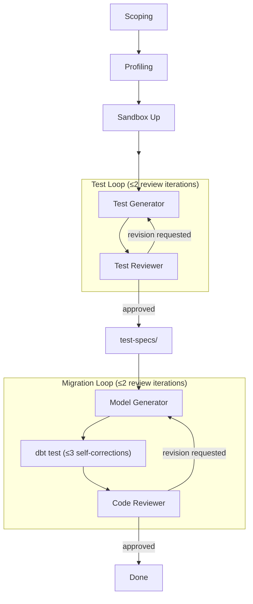

# Overall Design

Migration utility for stored-procedure-to-dbt conversion: Claude Code plugin commands for both interactive and multi-table migration. Targets silver and gold transformations only (bronze is out of scope).

## Supported Sources

| Technology | `technology` value | DDL extraction | Test generator access |
|---|---|---|---|
| SQL Server | `sql_server` | Live MCP (`mssql-execute-sql`) | Docker + SQL Server container (GH Actions) |
| Fabric Warehouse | `fabric_warehouse` | `.zip` (DDL export) | T-SQL cloud endpoint |
| Fabric Lakehouse | `fabric_lakehouse` | `.zip` (DDL export) | Spark SQL |
| Snowflake | `snowflake` | `.zip` (DDL export) | SQL cloud connection |

---

## Environment Setup

Four commands prepare a migration repo before any per-table work begins. Steps 1-3 run once per project; step 4 runs once per test-generation batch.

| Step | Command | Type | Prerequisites | Produces |
|---|---|---|---|---|
| 1. Scaffold project | `/init-ad-migration` | Plugin command | Plugin loaded, uv, Python 3.11+ | `CLAUDE.md`, `README.md`, `repo-map.json`, `.gitignore`, `.githooks/` |
| 2. Extract DDL + catalog | `/setup-ddl` | Skill (interactive) | toolbox on PATH, MSSQL env vars (`MSSQL_HOST`, `MSSQL_PORT`, `SA_PASSWORD`) | `manifest.json`, `ddl/*.sql`, `catalog/**/*.json` |
| 3. Scaffold dbt project | `/init-dbt` | Plugin command | `manifest.json`, populated `catalog/tables/` | `dbt/` project tree with `sources.yml` |
| 4. Create test sandbox | `/setup-sandbox` | Plugin command | `manifest.json`, MSSQL env vars | `__test_<random_hex>` throwaway database |

### Prerequisites

1. **GitHub account** with `gh` CLI authenticated (`gh auth login`).
2. **Claude Code CLI** installed and authenticated.
3. **`ad-migration` plugin** installed (marketplace package containing bootstrap, migration, and ground-truth-harness plugins).

### Step details

**`/init-ad-migration`** — checks prerequisites (uv, Python, toolbox, MSSQL vars, git, direnv), presents a plan, then scaffolds project files and configures git hooks. Entry point for every new migration project.

**`/setup-ddl`** — connects to a live SQL Server via MCP, extracts DDL for a user-selected database and schemas, builds catalog files with 12 signal queries (PKs, FKs, identity, CDC, change tracking, sensitivity, DMF refs), and runs AST enrichment. All downstream stages depend on the catalog this produces.

**`/init-dbt`** — reads `manifest.json` and catalog to scaffold a dbt project with adapter-specific `profiles.yml` and `sources.yml` generated from catalog tables. User picks target platform (Fabric Lakehouse, Spark, Snowflake, DuckDB). Idempotent — regenerates `sources.yml` on re-run, never overwrites `profiles.yml`.

**`/setup-sandbox`** — checks prerequisites, then calls `test-harness sandbox-up` to create a throwaway database (`__test_<random_hex>`) by cloning schema and procedures from the source SQL Server. Persists the sandbox database name to `manifest.json`. Used by the test generator to execute procs and capture ground truth. Torn down via `/teardown-sandbox`.

---

## Migration Workflow

Per-table pipeline with two quality-gate review loops:



| Path | Entry point | Approval gates | Runs where |
|---|---|---|---|
| Interactive | FDE uses skills (`/listing-objects`, `/analyzing-table`, `/profiling-table`, `/generating-tests`, `/generating-model`) | Yes — every step | Local terminal |
| Multi-table | FDE uses commands (`/scope`, `/profile`, `/generate-tests`, `/generate-model`) | FDE reviews summary at end | Local terminal |

### Stages

| Stage | Executor | Role |
|---|---|---|
| Scoping | `/scope` command | Delegates to `/analyzing-table` per table. Discovers writers, analyzes candidates via procedure-analysis reference, writes `selected_writer` to catalog. |
| Profiling | `/profile` command | Delegates to `/profiling-table` per table. Classifies table, identifies keys, watermark, FKs, PII. Writes profile answers to catalog. |
| Sandbox Up | `/setup-sandbox` command | Create throwaway database for ground-truth capture. Wraps `test-harness sandbox-up` CLI, persists sandbox metadata to `manifest.json`. |
| Test Generation | `/generate-tests` command | Enumerates proc branches, synthesizes fixtures, executes proc in sandbox, captures ground truth, writes `test-specs/<item_id>.json`. Review loop independently enumerates branches, scores coverage, reviews fixture quality. Kicks back for missing branches or quality issues. **Max 2 review iterations.** |
| Migration | `/generate-model` command | Reads profile + test spec, generates dbt model + schema YAML (with `unit_tests:` rendered from test spec), runs `dbt test`, self-corrects up to **3 iterations**. Code review loop checks standards, correctness, test integration. Kicks back for issues. **Max 2 review iterations.** |

**Key design decisions:**

- Test generation runs BEFORE migration — the model-generator consumes the approved test spec and must pass `dbt test` against it.
- Review skills are pure quality gates — they don't generate artifacts or modify files.

Full per-skill contracts (input/output schemas, pipeline steps, boundary rules): [Skill Contracts](../skill-contract/README.md).

---

## Migration Repository

One project per repo. The migration repo is shared state between all execution paths — catalog files are the source of truth that every stage reads and writes.

### Core Layout

```text
manifest.json                       # source metadata (technology, dialect, database, schemas)
catalog/                            # shared state — all stages read/write here
  tables/
    <schema>.<table>.json           # columns, keys, FKs, PII, profile answers, scoping results
  procedures/
    <schema>.<proc>.json            # params, references, resolved statements
  views/
    <schema>.<view>.json
  functions/
    <schema>.<func>.json
ddl/                                # extracted DDL — read-only after setup-ddl
  tables.sql
  procedures.sql
  views.sql
  functions.sql
test-specs/                         # test-generator output → model-generator input
  <item_id>.json                    # branch manifest, unit_tests[], ground truth
dbt/                                # generated dbt project
  models/
    staging/
      sources.yml                   # generated by init-dbt from catalog
    ...
```

### Status Updates

Commands write directly to catalog files, test-specs, and dbt models via sub-agents. The catalog IS the pipeline state. Run metadata (timing, cost, per-item status) is collected in `.migration-runs/` (`.gitignore`d) — consumed at commit/PR time for rich messages, then stays local.

---

## Execution Model

Each pipeline stage has a skill (single-table, interactive) and a command (multi-table, parallel sub-agents). The skill defines the per-table processing rules. The command orchestrates multiple tables by spawning one sub-agent per table, each following the skill's rules.

| Entry point | Tables | Approval |
|---|---|---|
| Skill (`/analyzing-table`, `/profiling-table`, etc.) | One | FDE reviews inline |
| Command (`/scope`, `/profile`, etc.) | Multiple | FDE reviews summary at end |

### Interactive (skills)

The FDE drives the pipeline one table at a time:

1. `/listing-objects` — list tables, pick one
2. `/analyzing-table` — discover writers, analyze candidates, FDE confirms
3. `/profiling-table` — catalog signals + LLM inference, FDE approves
4. `/generating-tests` — branch analysis, fixture synthesis, sandbox execution, ground truth capture
5. `/generating-model` — generate dbt model from profile + test spec, FDE approves before file write

Each step reads from and writes to catalog files. The FDE reviews and edits before approving.

### Multi-table (commands)

The FDE passes multiple table names to a command:

```text
/scoping silver.DimCustomer silver.DimProduct silver.FactSales
```

Each command:

1. Creates a worktree (e.g. `../worktrees/scope-silver-dimcustomer-silver-dimproduct`) so the FDE can run multiple commands in parallel
2. Spawns one sub-agent per table in parallel — each sub-agent follows the skill's processing rules
3. Sub-agents run autonomously (skip-and-continue on errors)
4. Collects per-table results into `.migration-runs/`
5. Aggregates `.migration-runs/summary.json`
6. Presents summary to FDE, asks: commit + PR?

### Run log (ephemeral)

Run summaries are collected in `.migration-runs/` (`.gitignore`d). Cleared at the start of each command invocation.

```text
.migration-runs/
  meta.json                        # stage, tables, started_at
  <schema>.<table>.json            # one per item — sub-agent writes on completion
  summary.json                     # command writes after all sub-agents finish
```

Consumed at commit/PR time for rich messages, stays local.

---

## Status

No separate status store. Durable status is git — catalog files, test-specs, and dbt models are committed artifacts. To see what's done, read the repo.

Diagnostics (errors, warnings) are stored per-table in catalog files as `diagnostics_entry` arrays — they travel with the table through the pipeline. Run summaries are ephemeral and collected in `.migration-runs/` (see Execution Model above).

---

## Git and PR Strategy

### Branching

| Mode | Branch pattern | Created by |
|---|---|---|
| Interactive (skill) | FDE's current branch | FDE |
| Multi-table (command) | `<command>-<table1>-<table2>-...` (truncated to 60 chars) | Command, before spawning sub-agents |

Single-table skill invocations don't create branches — the FDE works on whatever branch they're already on.

### Commit Granularity

One commit per table, on FDE approval. Commands aggregate results into `.migration-runs/summary.json` and present to the FDE before committing.

### Error Handling

Sub-agents skip errored tables and continue. The command collects per-table status in `.migration-runs/` and surfaces errors in the summary. The FDE decides what to commit.

### Commit Messages

```text
<command>(<schema>.<table>): <one-line summary>
```

### PR Strategy

Commands open one PR per batch. The PR body includes:

- Stage and table list from `meta.json`
- Per-table status (success/skipped/error) from `summary.json`
- Diagnostics summary for any tables with warnings

PRs target the repo's default branch. The FDE reviews and merges — the command does not auto-merge.

Interactive skills do not open PRs automatically. The FDE manages PRs as part of their normal workflow.

### Worktree Cleanup

After a PR is merged, run `/cleanup-worktrees` to remove stale worktrees. The command scans all worktrees, checks each branch for a merged PR via `gh`, and removes the worktree + local + remote branch for merged ones. Can also target a single branch: `/cleanup-worktrees <branch-name>`.

### What Gets Committed

| Committed (durable) | Never committed (ephemeral) |
|---|---|
| `catalog/tables/*.json`, `catalog/procedures/*.json` | `.migration-runs/` (`.gitignore`d) |
| `test-specs/*.json` | |
| `dbt/models/**/*.sql`, `dbt/models/**/*.yml` | |
| `ddl/*.sql` (from setup, not per-batch) | |
